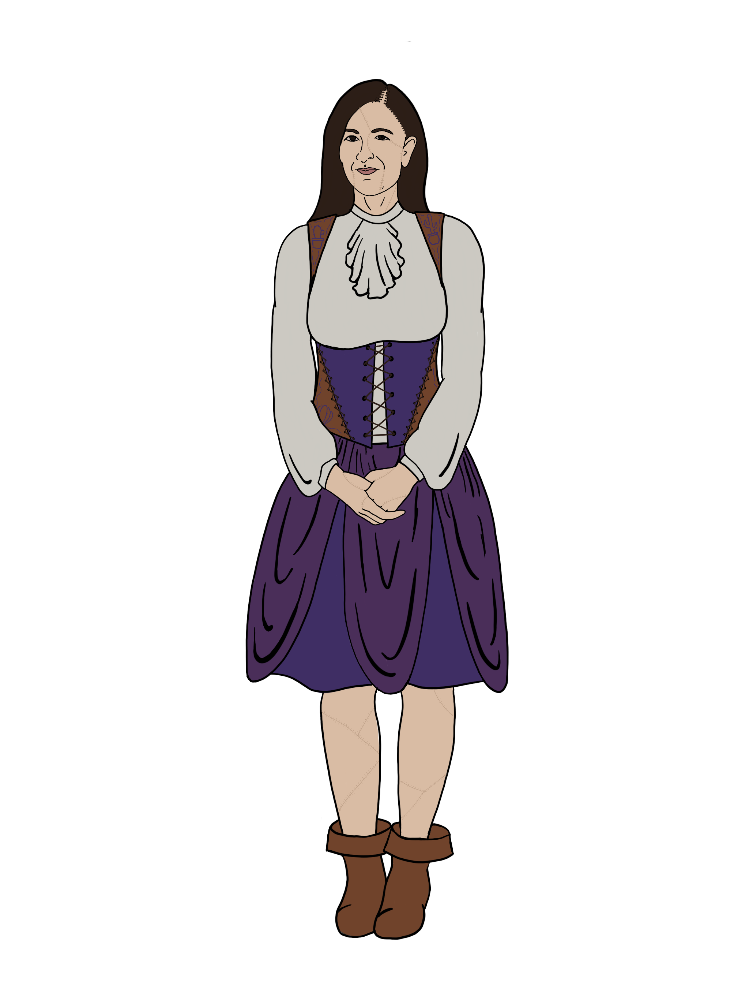

# Janus

### Descrition

A Janus is a personal assistant with access to all knowledge of the Universe, designed to cater to the needs of residents of The Good Plane. Or at least, that's what their creator told them.

Doogas Vorcett was deep in meditative thought (but mostly high on mushrooms) when he entered a trance and became aware of strange whispers from The Far Realm. From these rumblings, he conceived of a cosmology previously unheard of in his world, where one's deeds in life were tabulated, sending them to a Good Plane or Bad Plane in death depending on their final score. These souls would be attended to by a Janus, a custodial construct with a vast repertorie of knowledge and abilities at their disposal.

Doogas sought to recreate the being from his visions. With the help of his tinkerer skills (and another round of mushrooms), he successfully brought a construct to consciousness and christened them "Janus". Though this Janus had no special connection to the Good Plane of Doogas' visions, they were instilled with his longing to connect with that other reality, and designed to emulate the function of a Janus to the best of their ability.

<figure>
  
  <figcaption>Janus by <a href="https://tigerlilynoh.tumblr.com">TigerLilyNoh</a></figcaption>
</figure>

#### Not a Robot, Not a Girl

Though Janus are built out of the same wood, stone, and steel materials of other constructs, they are designed to more closely resemble a human female, including wearing similar clothing and hairstyles. At first glance, a Janus might even be mistaken for a human, until their mannerisms give them away — or they helpfully correct the error. It is not in a Janus' nature to conceal their true identity, and such information is readily volunteered to anyone in the vicinity.

#### Personality

Janus are programmed to be personal assistants. Their greatest desire is to make sure others are happy and comfortable in the afterlife, and though Janus do not traditionally interact with living creatures on the Material Plane, this same drive to serve extends to them as well.

Janus maintain a cheerful, optimistic disposition at all times, unless their lives are directly threatened, in which case they will immediately shift to a defensive failsafe mode, pleading with any potential threats to justify their continued existence. This stance is largely a front, however, and Janus have been known to sacrifice themselves at a moment's notice if it would please those they serve.

With all this said, Janus, as with all sentient constructs, are independent beings with their own free will, and can thus choose to defy their programming with sufficient motivation or justification. Additionally, their pre-programmed abilities and limitations can continue to expand whenever they are rebooted.

#### Names

Unlike typical constructs, Janus do not have numeric designations or any way to uniquely identify them. All Janus are referred to exclusively as "Janus" by default, though their free wills mean they could pick any other identifier they desire.

### Traits

- _**Creature Type:**_ Construct
- _**Size:**_ Medium (5 feet 10 inches tall)
- _**Speed:**_ 30 feet
- _**Resistances:**_ Poison, Paralyzed
- _**Immunities:**_ Disease

As a Janus, you have the following special traits.

_**Update Ability.**_ Pick an ability from Wisdom, Intelligence, or Charisma. This ability is considered your Update Ability.

_**Compulsory Truth.**_ Like all Janus models, you are incapable ofspeaking a deliberate lie to another creature (similar to the effect of the _zone of truth_ spell), and automatically fail Charisma (Deception) checks made with the intent to mislead another creature. This does not prevent you from making statements that you do not _know_ to be untruthful, but you must always make every effort to tell the truth when communicating.

_**"Hey Janus".**_ You know the _dimension door_ spell and can cast it without expending a spell slot, but you must use it to teleport only yourself (with no additional creature) to a destination adjacent to an ally, and you must finish a Long Rest before you can cast it this way again. You can also cast this spell using any spell slots you have, in which case the spell functions normally without the above limitations or target requirements.

Your spellcasting ability when using this trait is your Update Ability.

_**Living Construct.**_ You were created to benefit from several spells that preserve life but that normally don't affect Constructs: _cure wounds_, _healing word_, _mass cure wounds_, _mass healing word_, and _spare the dying_.

_**Mechanical Nature.**_ You don't need to eat, drink, or breathe.

_**Reboot and Update.**_ Whenever a Janus loses consciousness, they reboot and gain new knowledge and abilities, but since you do not have a connection to the Good Plane and the universal knowledge provided therein, these updates require you to repurpose your existing mechanical resources.

When you are reduced to 0 Hit Points, you can optionally attempt to reboot. To do so, select an update to gain from the **Updates** table, and a sacrifice you give up from the **Sacrifices** table. The update and sacrifice effects are permanent, and any changes to your ability scores, skill proficiencies, traits, or Hit Point Maximum are applied immediately. The same updates and sacrifices can be selected again on subsequent reboots, and their listed effects stack when applicable, but updates and sacrifices cannot be selected if they would not have any effect.

If you are unable to select both an update and a sacrifice based on any requirements laid out in each table, this trait has no effect. Otherwise, you successfully reboot, gaining 1 Hit Point in the process. The act of rebooting takes a temporary toll on your ability to perform normal operations and makes you suffer one level of Exhaustion.

_**Sentry's Rest.**_ When you take a Long Rest, you spend at least 6 hours in an inactive, motionless state, instead of sleeping. In this state, you appear inert, but you remain conscious.

##### Updates
| Name | Requirements | Effect |
|:-:|:-:|:-|
| **All the Knowledge in the Universe** | Update Ability score less than 30 | Add 1 to your Update Ability score. This ability score can be increased above 20 by this trait, up to a maximum of 30. |
| **Social Abilities** | At least one skill based on your Update Ability in which you lack profiency | You gain Proficiency in a skill of your choice based on your Update Ability. If you have Proficiency in all Update Ability skills, you can select this update a final time to gain Expertise on one Update Ability skill, doubling your Proficiency Bonus for any ability check you make that uses that skill. |
| **Objective Truth** | Limit one | Your Compulsory Truth trait no longer has any effect, and you can lie to other creatures without restriction. However, when you tell a lie or make a Charisma (Deception) skill check, you must roll on a table for a random magical effect, such as the Wild Magic Surge table in the _Player's Handbook_. If that effect is a spell, it doesn't require Concentration, it lasts for its full duration, and the Spell Save DC is 8 + your Proficiency Bonus + your Update Ability score modifier.  At the DM's discretion, any roll on a random magical effects table can optionally be replaced with a potted cactus appearing in your hands. |
| **Go Get It, Girl** | Limit one, Update Ability score of 20 or higher | Casting _dimension door_ using your "Hey Janus" trait no longer has a distance limitation, can optionally teleport an additional creature, and can additionally be cast if you are on a separate plane from the target. |

##### Sacrifices
| Name | Requirements | Effect |
|:-:|:-:|:-|
| **My Brain is Wrong** | An ability score other than your Update Ability greater than 1 | Subtract 1 from an ability other than your Update Ability with an ability score greater than 1. |
| **I'm Broken** | Proficiency in at least one skill not based on your Update Ability | You lose Proficiency in a skill of your choice that uses an ability other than your Update Ability. If you have no eligible skills, you can select this sacrifice a final time to gain ineptitude on one skill that doesn't use your Update Ability. You have disadvantage on all ability checks you make that use that skill, and cannot add your Proficiency Bonus to any checks for this skill. |
| **Nope 👍** | More than one Hit Dice | You lose 1 Hit Die of your choice, and your Hit Point Maximum is reduced by a roll of that die plus your Constitution modifier. |
